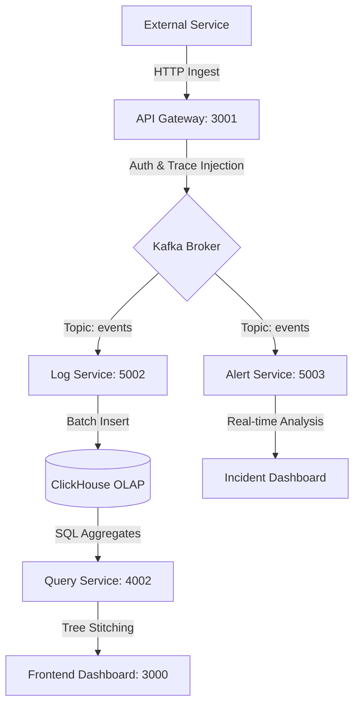

# Galecto: The Next-Generation Observability Suite
**Technical Whitepaper & Operator Manual**

---

## 1. Executive Overview
**Galecto** is an enterprise-grade distributed observability platform designed for high-throughput microservice architectures. It provides three-dimensional visibility—Traces, Logs, and Metrics—combined with a first-of-its-kind **Causality Replay Engine** that allows developers to re-execute historical requests to verify incident fixes.

## 2. Technical Architecture & Pipeline
Galecto follows a **Streaming OLAP Architecture**, ensuring that ingestion never blocks querying and that data is stitched in real-time.

### The Data Journey (Pipeline)


---

## 3. The Tech Stack
*   **Frontend**: Next.js 14, React Flow (Graphs), ECharts (Metrics).
*   **Backend**: Node.js, Fastify, TypeScript, Prisma.
*   **Big Data**: ClickHouse (Primary Telemetry Store).
*   **Message Broker**: Apache Kafka + Zookeeper.
*   **Metadata/Auth**: PostgreSQL + Redis.

---

## 4. System Runbook (Commands)

### Prerequisites
Ensure Docker is running and you are in the project root.

### Step 1: Spin up Infrastructure
```bash
cd infra/docker
docker-compose up -d
```

### Step 2: Launch Microservices (Separate Terminals)
```bash
# Terminal 1: Identity & Metadata
cd apps/auth-service && npm run dev

# Terminal 2: Edge Ingestion & Replay Proxy
cd apps/api-gateway && npm run dev

# Terminal 3: Event Processor (Kafka -> ClickHouse)
cd apps/log-service && npm run dev

# Terminal 4: Intelligence Engine (Stitching & Metrics)
cd apps/query-service && npm run dev

# Terminal 5: Anomaly Detector (Kafka Consumer)
cd apps/alert-service && npm run dev

# Terminal 6: Galecto SaaS Dashboard
cd apps/frontend && npm run dev
```

---

## 5. End-to-End User Journey (How to Use Galecto)

### Step 1: Onboarding (Landing -> Login)
*   **Home Page**: Visit `localhost:3000` to see the Galecto value proposition.
*   **Authentication**: Click **"Sign Up"** to create your organization workspace. Once logged in, you will be redirected to the **Main Dashboard**.

### Step 2: The Command Center (Dashboard)
*   View your **Global Traffic** overview and **System Health** cards.
*   This page gives you a snapshot of your entire distributed cluster's pulse.

### Step 3: Visualizing Causality (Request Tracing)
*   Navigate to **Request Tracing**.
*   Select any live request from the feed.
*   Click **"View Graph"** to open the **React Flow Canvas**. You can see exactly how the request moved through your microservices, including sub-second timing for every hop.

### Step 4: Investigating the Raw Data (Logs Explorer)
*   Go to **Logs Explorer**.
*   Use the **Global Search** to filter through millions of structured logs in ClickHouse.
*   Filter by `Service Name` or search for specific `Trace IDs` to see the log-context behind a specific request.

### Step 5: Fixing the Future (Replay System)
*   Navigate to **Replay System**.
*   The system automatically highlights **Anomalies** (4xx/5xx errors).
*   Click **"Prepare Replay"** on a failed trace. Galecto will retrieve the exact original request payload (Headers/Body).
*   Click **"Execute Replay"** to re-fire the request in a "Shadow Environment". You can now compare the original failure with the new trace side-by-side to verify your code fix.

### Step 6: Incident Management (Alerts)
*   Go to the **Alerts** page to see real-time anomalies detected by the `alert-service`.
*   Acknowledge incidents and mark them as **"Resolved"** once you have verified the fix via the Replay system.

### Step 7: Real-time Telemetry (Monitoring)
*   The **Monitoring** page provides the **"Quantum Stream"**—a live, high-speed feed of **P99 Latencies** and **Error Rates** across every service in your cluster.

### Step 8: Developer Setup (Developer Hub & Settings)
*   Go to **Developer Hub** to get your SDK integration snippets.
*   Visit **Settings** to:
    *   Create separate **Projects** (Prod/Staging).
    *   Generate **API Keys**.
    *   Set **Data Retention Policies** (e.g., store data for 30 days).

---

## 6. Maintenance & Scalability
*   **Data Pruning**: Galecto automatically prunes data older than your retention setting via the `RetentionWorker`.
*   **Storage**: ClickHouse scales horizontally to handle petabytes of telemetry.
*   **Security**: All endpoints are protected via JWT with strict Organization-level isolation.

---
**Galecto v1.0.0**  
*Observability without limits.*
